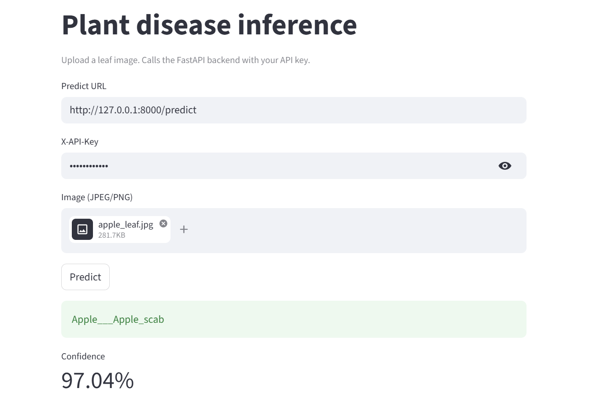
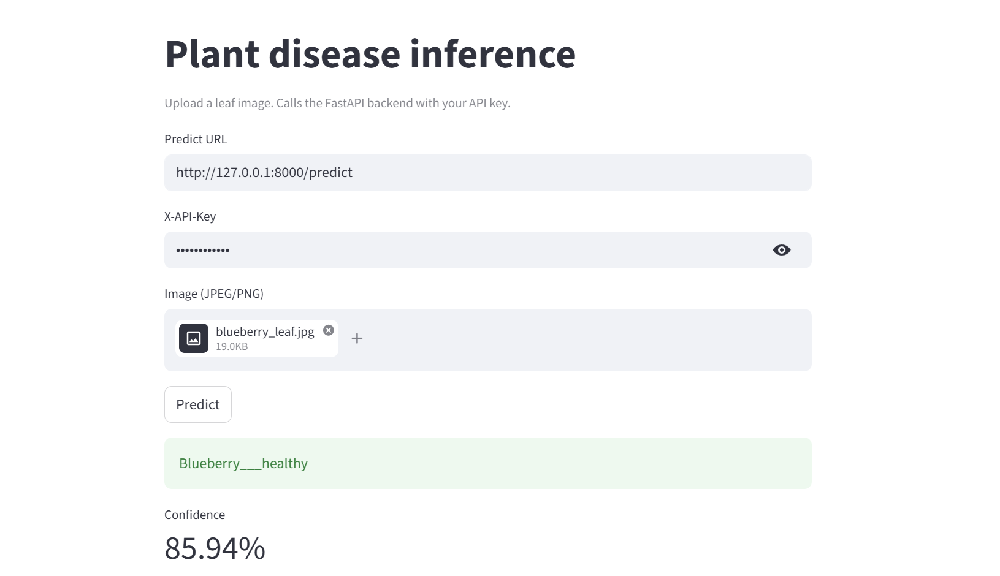
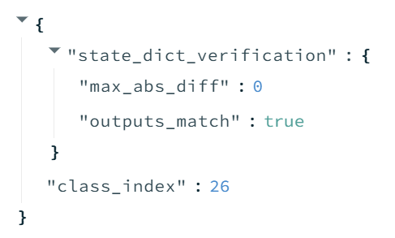

### 1. 프로젝트 소개
이 프로젝트는 식물 잎 이미지를 업로드하면 어떤 식물인지 맞추는 모델을 사용해 API 서버를 만드는 것이다. FastAPI를 사용해서 서버를 만들고, HuggingFace에 있는 모델을 가져와서 실제로 동작하도록 구현했다.

### 2. 구현 과정
predict라는 엔드포인트를 만들어서 사용자가 이미지를 업로드하면 파일이 PNG나 JPEG인지 확인하고, 크기가 5MB 이하인지도 체크해서 이상한 파일이 들어오지 않도록 했다.

그 다음에는 API key 인증을 추가해서, 요청이 들어올 때마다 키를 확인하도록 설정했다. 이미 만들어져 있던 verify_api_key를 연결해서 사용했다. 

모델 부분에서는 HuggingFace에 있는 Daksh159/plant-disease-mobilenetv2 모델을 불러와서 사용했다. 서버가 시작될 때 모델을 한 번 로딩해두고, 요청이 들어오면 해당 모델로 예측을 수행하도록 만들었다. 그리고 모델 추론이 들어가는 거니까 서버가 멈추지 않도록 run_in_executor를 사용해서 따로 실행하도록 했다.

또 하나 구현한 부분은 결과 검증이다. 모델의 state_dict를 다시 불러와서 동일한 입력으로 한 번 더 예측을 수행했다. 그리고 두 결과가 거의 같은지 비교해서, 모델이 정상적으로 동작하는지도 함께 확인하도록 했다.

마지막으로 Streamlit을 사용해서 간단한 화면도 만들었다. 이미지를 업로드하면 API를 호출해서 결과를 보여주는 형태로 구성했다. 이를 통해 서버가 실제로 잘 동작하는지 눈으로 확인할 수 있다.

### 3. 어려웠던 점
실제로 테스트를 해보니, 예측 인덱스는 맞는데 라벨 이름이 틀리는 문제가 있었다. 예를 들어 같은 사과지만 이미지를 다르게 해서 업로드했을 때 모델이 높은 확률로 같은 인덱스를 내뱉지만, 이름을 "사과"라고 내뱉지 않고 다른 품종을 내뱉는 문제였다. 그래서 전체 리스트를 바꾸지 않고, 특정 인덱스만 하나씩 수정하는 방식으로 라벨을 맞춰 나갔다. 예를 들어 0번은 Tomato, 12번은 Blueberry처럼 직접 확인한 결과를 기준으로 수정했다. 지금까지는 해당 모델 README를 보면 38가지가 있던데 다 수정하기에는 시간이 걸려서 임시방편으로 일부만 수정하고 같은 사진으로 테스트해봤을 때 정답이 동일하게 나오는 정도까지만 확인한 상태다.

위의 문제는 사실 꼼꼼히 살펴보지 않은 내 잘못이 있다고 생각한다. 해당 모델의 README 내용에서는 class_names.json이라는 파일이 포함되어 있다고는 했지만, 실제 첨부된 파일들을 보면 class_names.json이 없다. 적어도 내 눈에는 안 보였다. 물론 class_names.json이 어떤 역할을 하는지도 몰랐었지만, 모델을 정하고 열심히 ai와 협업하면서 라벨 파일의 필요성을 뒤늦게 깨달았던 터라 부랴부랴 이미지 가져와서 테스트하고 나온 결과를 라벨 붙이는 식으로 급하게 짰다.

### 결과
이미지를 업로드하면 다음과 같이 예측 결과가 정상적으로 출력된다.

예를 들어, 사과 잎 이미지를 넣었을 때 apple___healthy와 같은 결과가 반환된다.

### 회고(참고 링크 및 코드 개선)
첫화면 api key 인증할 때 눈 아이콘을 켜면 기존의 비번이 보이는 걸 고치지 않아서, 추후에 진짜 프로젝트를 진행하면 고쳐볼 예정이다.

사실 README 파일을 읽어도 모르는 내용이 많지만, 누락된 파일이 없는지, 내가 추가로 준비해야 하는 것들이 있는지를 좀 더 꼼꼼히 살펴봐야할 것 같다. 모델 고르는 것에만 집중하느라 좀 더 세심하게 살펴보지 못한 게 실수였다.

그래도 이전부터 비슷한 프로세스로 3번? 정도 반복했어서 그런지, 어떤 내용을 가지고 ai와 얘기를 나누고 판을 짜야하는지 조금씩 알게된 것 같다. 이렇게 결과물을 만들면서 하나의 서비스 흐름을 볼 수 있어서 정말 유익하다고 생각했고, 특히 ai를 정말 몰랐던 일상을 살아왔던 나도 ai를 조금은 이해할 수 있구나, ai라는 시대적 큰 파도에 나도 올라탈 수 있지 않을까..?하는 희망이 생겼다. 아직 능숙히 다루기엔 시간이 꽤나 오래 걸리겠지만, 퍼실님들께서 누차 말씀하셨던 포기하지 말라고 하셨던 게 생각이 난다 :)

### DAY 8 최종 체크포인트
Q1. 본인의 프로젝트에서 Pydantic 검증은 어떤 잘못된 입력을 막아줍니까?
모델이 낸 응답 이 이상하지 않도록 에러 상황을 차단하고 있다. 식물 잎 분류하는 모델을 선택했고, confidence는 0~1 사이여야 한다, NaN 값이면 에러 나게 해라 등등 설정했다.

Q2. Depends(verify_api_key)를 제거하면 어떤 위험이 있습니까?
api key 검증이 없이 아무나 서버를 사용하게 되면, 악의적인 요청이 들어올 수도 있고 과도한 트래픽 때문에 서버가 느려지거나 GPU 과도 사용으로 비용이 많이 들 수 있다.

Q3. run_in_executor를 사용한 이유는 무엇입니까?
추론같은 무거운 작업은 CPU가 담당하기 때문에 그대로 실행하면 서버가 멈춘 것처럼 된다. 다른 일처리를 할 수 없으니, 무거운 작업용 공간을 따로 만들어서 거기서 일처리를 하고 다른 가벼운 요청들을 계속 처리할 수 있게끔 한다.

Q4. Day 1~8 중 가장 많이 참고한 Day는 어디였습니까? 왜?
day 기준으로 참고했다 말하기가 좀 어렵다. 제공된 예제 공부할 때마다 로컬에 폴더별로 다 저장해놓은 상태여서 몇번째 날인지는 모르겠다. 재사용한 코드가 뭐냐고 하신다면 auth, middleware, image 처리, 에러 핸들링 부분이고, 그외에 예제별 코드들도 참고했다. 

Q5. 이 서비스를 실제로 배포하려면 추가로 무엇이 필요합니까?
서버를 인터넷에서 접근할 수 있게끔 해야 하지 않을까? 클라우드 서버 사용한다든지, https 설정한다든지.. 이후의 개념은 아직 잘 모르겠다.